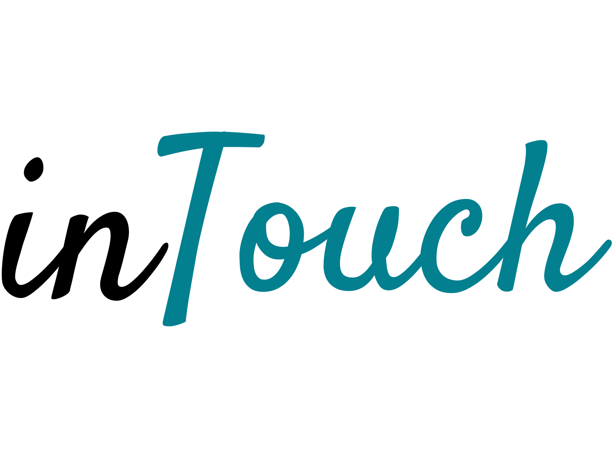
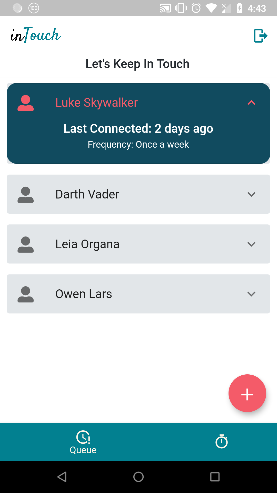

## Inspiration
InTouch was inspired by our joint frustration at the current system of networking. Despite constant contact with new people, we and many others, find the majority of our connections to be unutilized and superficial. Since research has shown that the strength of acquaintances is what leads to career growth, current methods of networking may be ineffective. We hope to spur a paradigm shift, fostering mutually beneficial and genuine relationships out of our most distant ties.

## What it does
Based on research from Harvard Business School, InTouch is a mobile platform that analyzes, personalizes, and nurtures real relationships from superficial connections. InTouch will focus on three approaches: a) contact prioritization, b) regular interaction, and c) substance of contact. Through personalized data analysis/optimization, the platform will remind the user to reach out on a pre-determined schedule. We envision InTouch as an extension to many social networking sites. For instance, InTouch could assist in cultivating genuine relationships from new, but distant Linkedin connections.

## How we built it
The system is centered around a flask web server deployed using Google App Engine. It makes use of a FireStore database for storing data, and queries LinkedIn's API to gather information on users and how their network changes. The information is displayed to the user through a flutter application written in dart which is compatible with web, android, and iOS. We handle reminding users to keep in contact with their network using Twilio, which we think is beneficial over push notifications, as it is much easier to come back to a text message if you're busy at the time you receive the notification.

## Challenges we ran into
We ran into several challenges, including understanding and accessing Linkedin API, and installing Google Cloud. We found the documentation for the LinkedIn API to be unclear in parts, so we spent a lot of time working together to try and understand how to use it.

## Accomplishments that we're proud of
We think that our idea is quite original and that it has a lot of potential, envisioning it even being useful for our own network. We spent over 6 hours deciding on it, so we're really proud that after all that time and discussion that we ended up with something, which we think could help people.

## What we learned
We spent a lot more time than we normally would coming up with the idea, and this proved fruitful, so we learned that stopping to think about what you're doing can really help in the long run.

## What's next for InTouch
There are many research articles that suggest ways to cultivate and maintain a large network. For instance, frequency of contact and how personal a certain message is, can greatly strengthen connections. We hope to integrate many of these aspects into InTouch.

## Built With
python
google-cloud
flask
flutter
dart
android-studio
visual-studio
ios
android
swift
kotlin
